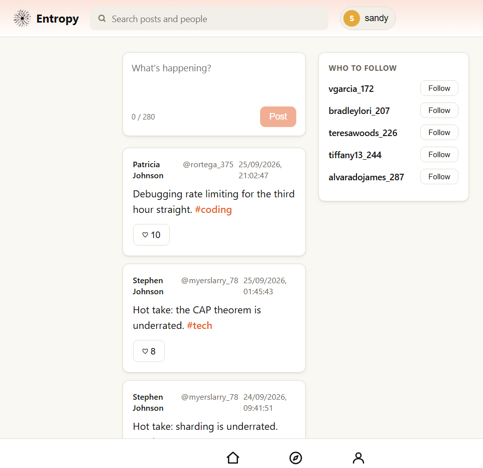
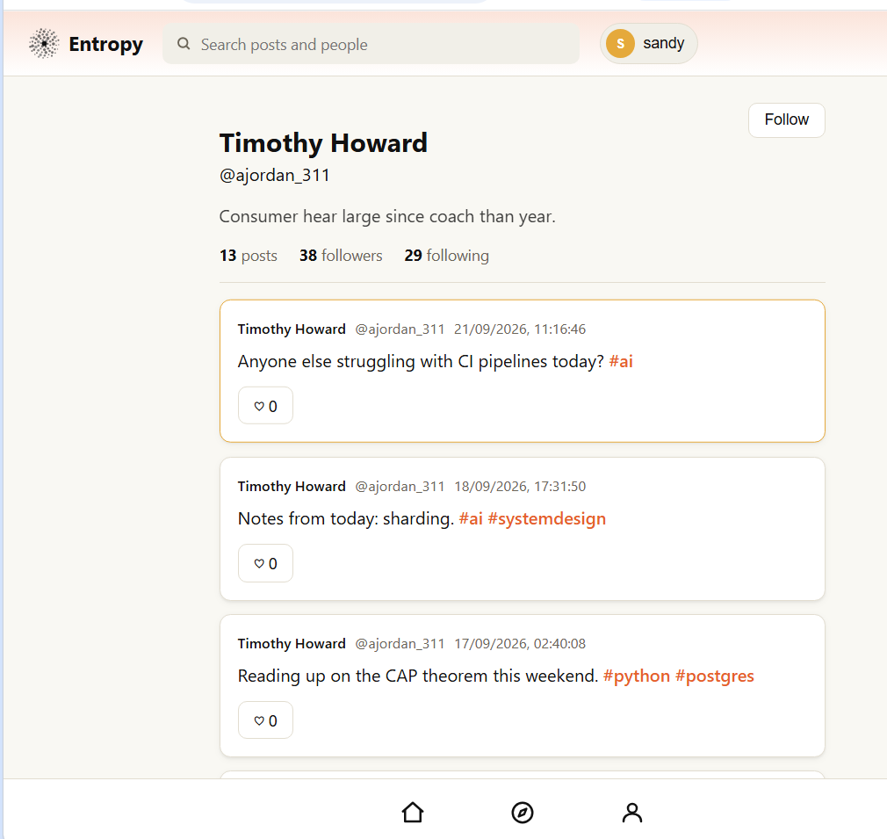
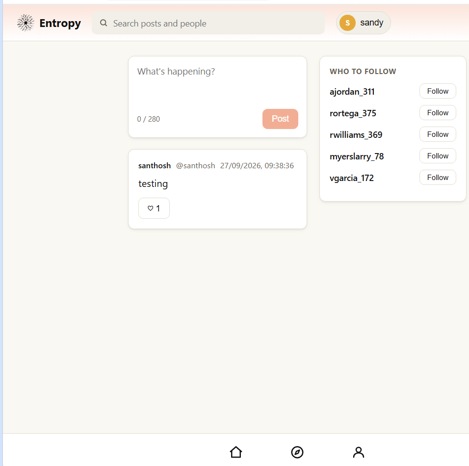
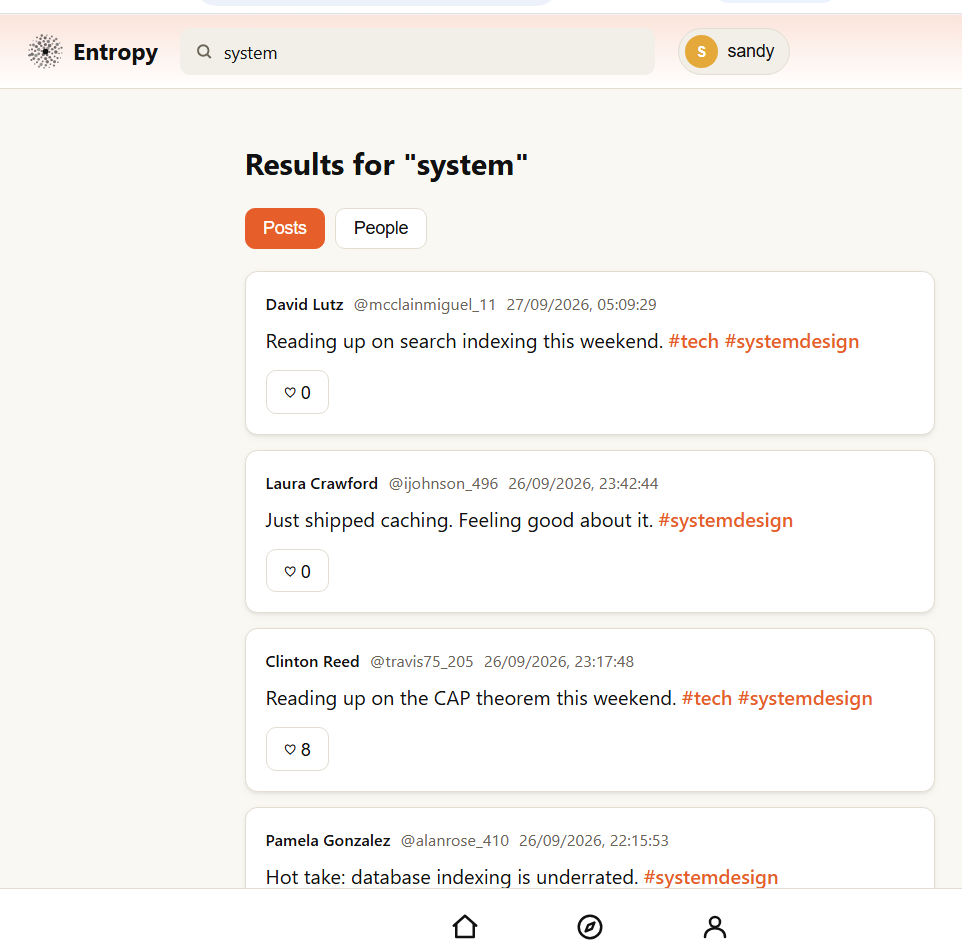
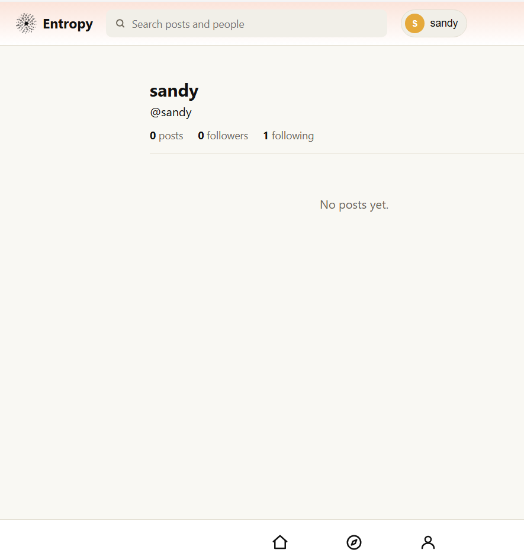

# Entropy

A micro-posting app built to practice a real backend architecture — caching, fan-out, search, and auth — at small scale. People register, post short text with hashtags, follow each other, and see a home feed.

## Live

- App: https://entropy-app-six.vercel.app
- API docs: https://entropy-api-xnxf.onrender.com/docs

The backend is on a free tier and sleeps after 15 minutes of no traffic. The first request after that can take up to a minute.

---

## Application Walkthrough & Interface Gallery

The interactive layout of the Entropy platform—spanning real-time relational feed generation and session authentication down to full-text database query indexing.


<table width="100%">
  <!-- Row 1: Top Flagship Hero Image (Personalized Home Feed) -->
  <tr>
    <td align="center" valign="top" colspan="2" width="100%">
      
      <br />
      <strong>1. Personalized Chronological Feed Feed Generation & Contextual Discovery</strong>
    </td>
  </tr>

  <!-- Row 2: Grid Part 1 - Main Layout vs Targeted Profile View -->
  <tr>
    <td align="center" valign="top" width="50%">
      
      <br />
      <strong>2. Centralized Microblogging Composer Dashboard & Social Timeline</strong>
    </td>
    <td align="center" valign="top" width="50%">
      
      <br />
      <strong>3. Dynamic Target Profile Index & Relation Social Graph Counts</strong>
    </td>
  </tr>

  <!-- Row 3: Grid Part 2 - Search Queries vs Session Authentication -->
  <tr>
    <td align="center" valign="top" width="50%">
      
      <br />
      <strong>4. Full-Text Database Search Query Indexing & Multi-Entity Filters</strong>
    </td>
    <td align="center" valign="top" width="50%">
      
      <br />
      <strong>5. Session-Authenticated Account State & Empty-State Management</strong>
    </td>
  </tr>
</table>


## How it works

When someone posts, the post is saved to Postgres first — that's the permanent copy. Right after that, the post's ID is pushed onto a Redis list for the author and each of their followers. When anyone opens their home feed, the app reads that list from Redis and only then looks up the actual post text from Postgres. Postgres is never queried for the feed itself unless the Redis list is empty, in which case it's rebuilt from Postgres and cached again.

The point of this is that opening the app doesn't run a database query across posts and follows every time — it reads a short list of IDs that's already sitting ready.

## Stack

| Layer | Tool | Why |
|---|---|---|
| Frontend | React + TypeScript + Vite | Typed, fast to build, plain component structure |
| Routing | React Router | Multiple pages (home, search, profile, explore) without a server round trip |
| Backend | FastAPI (Python) | Typed request/response models, and a free interactive `/docs` page for testing |
| Database | PostgreSQL (hosted on Neon) | Holds the real data — users, posts, follows, likes, hashtags |
| Cache | Redis (hosted on Upstash) | Holds each person's feed as a ready-made list, and a 5-minute cache of trending tags |
| Auth | JWT in an httpOnly cookie, bcrypt password hashing | The token can't be read by JavaScript in the browser, and passwords are never stored as plain text |
| Frontend hosting | Vercel | Builds and serves the React app |
| Backend hosting | Render | Runs the FastAPI app |

## Design decisions 

**Feed.** Each person has a Redis list of post IDs, newest first. Posting pushes the new ID onto the author's list and every follower's list. Reading the feed pulls from that list and fetches the matching rows from Postgres. If the list doesn't exist yet (cold cache, or it was cleared), it's rebuilt with one query and cached again. Following or unfollowing someone just clears the cached list, so the next read rebuilds it with the right people included.

**Search.** There's no separate search engine here — search runs directly against Postgres, using `pg_trgm` and `levenshtein` for fuzzy matching, so a typo like "sytsm" still finds "system". This works fine at this size. A dedicated search index would be the next step if the amount of data grew a lot.

**Trending.** One query counts hashtags from the last 24 hours, and the result is cached in Redis for 5 minutes. There's no background job computing this ahead of time — it's cheap enough to just run on demand and cache briefly.

**Seed data.** Every table has an `is_seed` column. The seed script uses Faker to generate fake users, follows, and posts for testing, all marked `is_seed = true`. Running the seed script's clear command removes only that data — real accounts and posts are never touched, since they're never marked as seed data.

## Tables

- **users** — account info, password hash
- **posts** — text (up to 280 characters), author, timestamp
- **follows** — who follows whom
- **hashtags** — tags extracted from each post, used for search and trending
- **likes** — who liked which post

## API

Routes are grouped under `/api/v1`:

- `/auth` — register, login, logout, current user
- `/posts` — create, delete, like/unlike
- `/timeline` — home feed
- `/users` — profiles, follow/unfollow, follow suggestions
- `/search` — posts and people, with typo tolerance
- `/trending` — top hashtags in the last 24 hours

Full request/response detail is in `/docs` (the live link above, or `http://localhost:8000/docs` when running locally).

## Running it locally

You'll need Docker (for Postgres and Redis), Python 3.11+, and Node.

```bash
# start Postgres and Redis
docker compose up -d

# backend
cd server
python -m venv venv
venv\Scripts\activate          # or: source venv/bin/activate on Mac/Linux
pip install -r requirements.txt
python -m app.db                # quick connection check
uvicorn app.main:app --reload

# frontend, in a second terminal
cd client
npm install
npm run dev
```

Copy `.env.example` to `.env` first and fill in a `JWT_SECRET`. The default `DATABASE_URL` and `REDIS_URL` values match the local Docker setup.

To load test data:

```bash
cd server
python -m app.seed          # add fake users, follows, posts
python -m app.seed --clear  # remove only the fake data
```

## Deployment

- **Frontend** → Vercel, built from `client/`, with `VITE_API_URL` set to the live backend URL.
- **Backend** → Render, built from `server/`, with `DATABASE_URL`, `REDIS_URL`, `JWT_SECRET`, `COOKIE_SECURE=true`, and `CORS_ORIGINS` set as environment variables.
- **Database** → Neon (Postgres), schema loaded once with `schema.sql`.
- **Cache** → Upstash (Redis).

One thing that isn't obvious: since the frontend and backend live on different domains (`vercel.app` and `onrender.com`), the login cookie needs `SameSite=None` plus `Secure` to be sent on requests between them. `SameSite=Lax`, which works fine when everything is on `localhost`, silently breaks login once frontend and backend are split across two real domains — the browser just won't attach the cookie.

## What's missing

This is built to show the architecture working, not to be a finished public product. Specifically not done yet:

- No email verification — anyone can register with any email address
- No password reset — a locked-out user currently has no way back in except manual help
- No admin or moderation tools
- No automated backups on the free-tier database
- Free-tier limits: Render's backend sleeps when idle, and Neon/Upstash both cap free storage